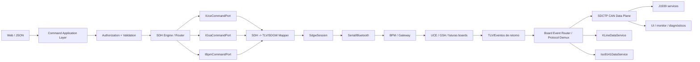

```mermaid
flowchart LR
    WEB["Web / JSON"] --> CMD["Command Application Layer"]
    CMD --> AUTH["Authorization + Validation"]
    AUTH --> SDHENG["SDH Engine / Router"]

    SDHENG --> UCEPORT["IUceCommandPort"]
    SDHENG --> GSAPORT["IGsaCommandPort"]
    SDHENG --> BPMPORT["IBpmCommandPort"]

    UCEPORT --> MAP["SDH -> TLV/SDGW Mapper"]
    GSAPORT --> MAP
    BPMPORT --> MAP

    MAP --> SDGW["SdgwSession"]
    SDGW --> TRANSPORT["Serial/Bluetooth"]

    TRANSPORT --> BPM["BPM / Gateway"]
    BPM --> BOARDS["UCE / GSA / futuras boards"]

    BOARDS --> RX["TLV/Eventos de retorno"]
    RX --> DEMUX["Board Event Router / Protocol Demux"]

    DEMUX --> SDCTP["SDCTP CAN Data Plane"]
    DEMUX --> KLINE["KLineDataService"]
    DEMUX --> ISO["Iso9141DataService"]

    SDCTP --> J1939["J1939 services"]
    SDCTP --> UI["UI / monitor / diagnósticos"]

```