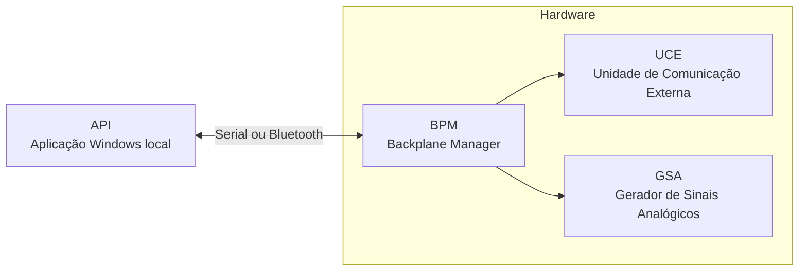

⬅ [Retornar para Visão Geral do Projeto](../01-visao-geral/01-visao-geral-projeto.md)
⬅ [Retornar para Índice Geral](../00-INDICE.md)

# Visão Arquitetural

A arquitetura do **SimulDIESEL** pode ser entendida por duas perspectivas complementares.

A primeira mostra **onde** cada parte está localizada na bancada: aplicação local, gateway, backplane, placas funcionais, conectores e módulo em teste.

A segunda mostra **como** o sistema funciona: como um comando sai da aplicação Windows, passa pela comunicação da bancada, chega ao gateway, é encaminhado para uma placa funcional e produz uma ação observável no módulo em teste.

Essa separação ajuda o leitor a não misturar estrutura física com comportamento operacional. Primeiro é possível localizar os blocos do sistema; depois, entender como eles trabalham juntos.

## Estrutura macro do sistema

Em visão macro, o SimulDIESEL pode ser entendido como a integração entre uma aplicação local e uma bancada eletrônica modular.

A **API** executa no computador e se comunica com o bloco de **Hardware** por conexão **Serial** ou **Bluetooth**. Dentro do hardware, a **BPM** atua como raiz da comunicação da bancada, enquanto placas funcionais como **UCE** e **GSA** ficam conectadas a ela como módulos dependentes.

Esse desenho mostra apenas a organização principal do sistema. Os protocolos internos, contratos de comunicação e fluxos detalhados são explicados nas próximas camadas da documentação.

## Dois caminhos oficiais de leitura

### Visão Física do Projeto

A visão física responde **onde** cada parte se encontra fisicamente na bancada e como as interligações materiais se organizam.

O foco está em:

* localização física dos elementos;
* conectores e interfaces;
* camadas superior e inferior de cada bloco;
* relações entre API, hardware e módulo em teste.

### Visão Lógica do Projeto

A visão lógica responde **como** o sistema opera, transporta comandos, roteia decisões e produz efeitos funcionais sobre a bancada.

O foco está em:

* funções de cada camada;
* protocolos e transporte;
* fluxos entre UI, software, gateway e boards;
* transformação de comando em ação observável.

## Navegação entre as duas leituras

As duas leituras podem se referenciar por texto, mas a mudança de uma leitura para outra deve passar por esta página.

Assim, a documentação mantém uma navegação controlada, clara e sem múltiplos atalhos para o mesmo conteúdo.

## Glossário

- **API**: aplicação Windows local responsável por controlar a bancada, enviar comandos e apresentar informações ao operador.
- **Arquitetura**: organização das partes do SimulDIESEL e das relações entre software, comunicação, hardware e módulo em teste.
- **Backplane**: estrutura central de interligação da bancada, usada para conectar placas funcionais e distribuir sinais, alimentação e comunicação.
- **Bluetooth**: uma das formas de conexão previstas entre a API e o bloco de hardware.
- **BPM**: Backplane Manager, placa raiz do bloco de hardware, responsável por intermediar a comunicação entre a API e as placas funcionais da bancada.
- **GSA**: Gerador de Sinais Analógicos, placa funcional voltada à geração de sinais elétricos contínuos para simulação de sensores e grandezas analógicas.
- **Hardware**: bloco físico da bancada composto pela BPM e pelas placas funcionais conectadas a ela.
- **Módulo em teste**: central ou módulo eletrônico Diesel conectado à bancada para diagnóstico, simulação ou validação.
- **Serial**: uma das formas de conexão previstas entre a API e o bloco de hardware.
- **UCE**: Unidade de Comunicação Externa, placa funcional voltada às interfaces de comunicação com os módulos em teste.
- **Visão física**: leitura orientada à localização, conexão e organização material dos componentes da bancada.
- **Visão lógica**: leitura orientada ao funcionamento, fluxo de comandos, responsabilidades e comportamento operacional do sistema.

## Próximas camadas

* [Visão Física do Projeto](02-visao-fisica.md)
* [Visão Lógica do Projeto](03-visao-logica.md)
