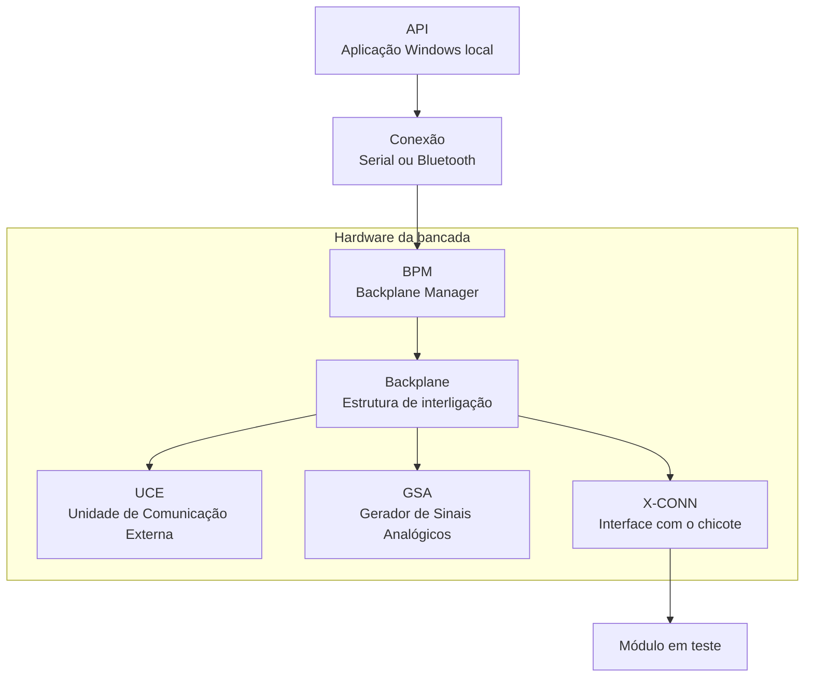

⬅ [Retornar para Visão Arquitetural](01-visao-arquitetural.md)
⬅ [Retornar para Índice Geral](../00-INDICE.md)

# Visão Física do Projeto

A visão física mostra **onde** cada parte do SimulDIESEL está posicionada dentro da bancada e como os blocos principais se conectam entre si.

Neste nível da documentação, o objetivo não é explicar os protocolos internos nem o funcionamento detalhado dos comandos. O foco é entender a organização material do projeto: aplicação local, comunicação com a bancada, backplane, placas funcionais, X-CONN, chicote e módulo em teste.

## Organização física em alto nível

A bancada pode ser entendida como uma sequência de blocos físicos e estruturais.

A **API** executa no computador e se comunica com a bancada por conexão Serial ou Bluetooth. A **BPM** fica no bloco de hardware e atua como raiz da comunicação física da bancada. A partir dela, o backplane organiza a interligação das placas funcionais e da interface com o módulo em teste.

## Principais blocos físicos

### API e Host Local

Representa o software executado no computador. É por ele que o operador interage com a bancada, abre telas, envia comandos e acompanha respostas.

Embora seja software, o host aparece nesta visão física porque ele é o ponto externo de operação da bancada e se conecta fisicamente ao hardware por Serial ou Bluetooth.

### Hardware da Bancada

Representa o conjunto físico formado pela BPM, pelo backplane e pelas placas funcionais conectadas ao rack.

Dentro desse bloco, a BPM atua como elemento central de comunicação. As placas funcionais, como UCE e GSA, executam funções específicas e são integradas à estrutura da bancada por meio do backplane.

### Módulo em Teste e X-CONN

Representa a ligação entre a bancada e o módulo eletrônico Diesel que será analisado.

A X-CONN faz a interface entre o chicote do módulo em teste e o backplane da bancada. Ela permite que os recursos da bancada cheguem aos pinos corretos do módulo, respeitando a organização física necessária para cada aplicação.

## O que esta página não detalha

Esta página apresenta apenas a organização física geral. Os detalhes de implementação ficam nas próximas camadas.

Por isso, esta página não aprofunda:

- protocolos internos de comunicação;
- contratos de comando;
- handshake, framing, retry ou sessão;
- pinagens completas;
- esquemáticos detalhados;
- funcionamento eletrônico interno de cada placa.

Esses assuntos são tratados nos documentos específicos de software, hardware, firmware e protocolos.

## Glossário

- **API**: aplicação Windows local usada pelo operador para controlar a bancada.
- **Backplane**: estrutura física de interligação da bancada, usada para distribuir sinais, alimentação e comunicação entre placas.
- **BPM**: Backplane Manager, placa central do hardware da bancada.
- **Chicote**: conjunto de fios e conectores usado para ligar o módulo em teste à bancada.
- **GSA**: Gerador de Sinais Analógicos, placa funcional responsável pela geração de sinais elétricos contínuos.
- **Host local**: computador e software local usados para operar a bancada.
- **Módulo em teste**: módulo eletrônico Diesel conectado à bancada para diagnóstico, simulação ou validação.
- **UCE**: Unidade de Comunicação Externa, placa funcional voltada às interfaces de comunicação com o módulo em teste.
- **Visão física**: leitura orientada à posição, conexão e organização material dos componentes.
- **X-CONN**: placa/interface que conecta o chicote do módulo ao backplane da bancada.

## Próximas camadas

- [API e Host Local](04-api-e-host-local.md)
- [Hardware da Bancada](10-hardware-da-bancada.md)
- [Módulo em Teste e X-CONN](11-modulo-em-teste-e-xconn.md)
