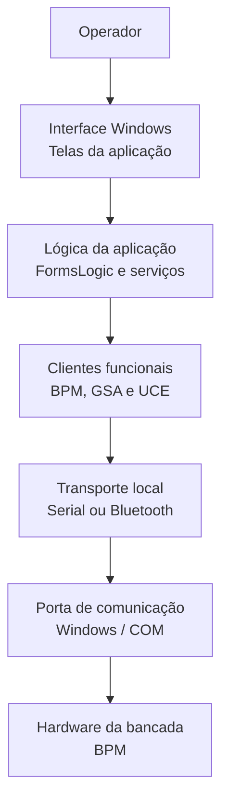

⬅ [Retornar para Visão Física do Projeto](02-visao-fisica.md)
⬅ [Retornar para Índice Geral](../00-INDICE.md)

# API e Host Local

A **API** é o software local do SimulDIESEL executado no computador do operador. Ela é o ponto de controle da bancada: por ela o usuário abre telas, escolhe funções, envia comandos, acompanha respostas e visualiza informações do módulo em teste.

Mesmo sendo software, a API aparece na visão física porque ela se conecta diretamente ao hardware da bancada por meio de uma comunicação Serial ou Bluetooth. Por isso, nesta leitura, o host local é tratado como o bloco externo que opera a bancada eletrônica.

## Papel do host na bancada

O host local concentra três responsabilidades principais:

- apresentar a interface de operação ao usuário;
- transformar ações da interface em comandos internos do sistema;
- manter uma conexão física ativa com a bancada, usando Serial ou Bluetooth.

A partir dele, o operador não precisa falar diretamente com as placas físicas. A API organiza essa comunicação e encaminha as ações para a BPM, que é a raiz do bloco de hardware.

## Organização física da aplicação

Em uma visão simplificada, a aplicação local pode ser entendida como uma pilha que começa na tela e termina na porta de comunicação do computador.

Esse diagrama não detalha todas as classes internas. Ele mostra apenas o caminho físico e estrutural: o operador usa a interface, a aplicação organiza o comando e o transporte local entrega a comunicação ao hardware.

## Interface com o usuário

A interface Windows é a camada visível da aplicação. Ela concentra telas de conexão, operação de boards, monitoramento e visualização de informações.

Nesta camada ficam as ações do operador, como conectar à bancada, acessar funções da GSA, acessar funções da UCE ou visualizar dados de rede.

## Lógica local da aplicação

Abaixo das telas existe uma camada de lógica local responsável por separar a interface da comunicação com a bancada.

Essa separação é importante porque evita que uma tela fale diretamente com Serial, Bluetooth, protocolos internos ou detalhes de baixo nível. A interface solicita uma ação; a lógica local decide como essa ação deve ser encaminhada.

## Comunicação com o hardware

A comunicação física entre o host e a bancada ocorre por Serial ou Bluetooth. Em ambos os casos, para o Windows, a comunicação chega à aplicação como uma porta de comunicação local.

A partir dessa conexão, a aplicação se comunica com a BPM, que assume o papel de entrada do bloco de hardware.

## Limites desta página

Esta página apresenta a posição da API e do host local dentro da visão física do SimulDIESEL.

Ela não detalha:

- todas as classes internas da aplicação;
- contratos de protocolo;
- regras de validação de comandos;
- funcionamento de scheduler, retry, framing ou sessão;
- decodificação CAN/J1939;
- estrutura detalhada de BLL, DAL, DTL e transporte.

Esses assuntos são tratados nas próximas camadas.

## Glossário

- **API**: aplicação Windows local usada para operar a bancada SimulDIESEL.
- **Bluetooth**: uma das formas de comunicação física entre o computador e a bancada.
- **FormsLogic**: camada da aplicação que separa ações da interface de chamadas internas do sistema.
- **Host local**: computador e aplicação local usados pelo operador para controlar a bancada.
- **Interface Windows**: conjunto de telas usadas pelo operador.
- **Porta COM**: porta de comunicação reconhecida pelo Windows para tráfego Serial ou Bluetooth.
- **Serial**: forma de comunicação física direta entre o computador e a bancada.
- **Transporte local**: parte da aplicação responsável por manter a comunicação física com a bancada.

## Próximas camadas

- [BLL do Host](05-bll-do-host.md)
- [DAL do Host](06-dal-do-host.md)
- [DTL do Host](07-dtl-do-host.md)
- [Transporte do Host](08-transporte-do-host.md)
