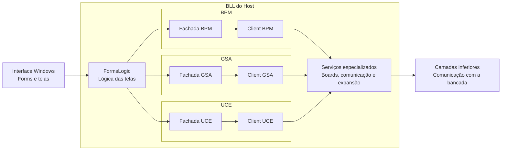

⬅ [Retornar para API e Host Local](04-api-e-host-local.md)
⬅ [Retornar para Índice Geral](../00-INDICE.md)

# BLL do Host

A **BLL do Host** é o bloco da aplicação responsável por organizar as ações vindas da interface Windows antes que elas sejam encaminhadas para as camadas inferiores do sistema.

Ela não é a tela e também não é o transporte físico. Sua função é ficar no meio: receber uma intenção da interface, escolher o serviço correto e entregar uma chamada mais organizada para a parte da aplicação que fala com a bancada.

Nesta visão física, a BLL é apresentada como um conjunto de sub-blocos internos, cada um com uma responsabilidade específica dentro do host local.

## Posição da BLL dentro do host

A BLL fica abaixo da interface Windows e acima das camadas inferiores responsáveis pela comunicação com o hardware.

O diagrama mostra que a interface Windows apenas inicia ações e recebe informações. A organização dessas ações acontece dentro da BLL, que agrupa a lógica por área de utilidade: BPM, GSA, UCE e serviços especializados.

## FormsLogic

A **FormsLogic** é a parte da BLL mais próxima das telas.

Ela existe para impedir que os formulários WinForms concentrem regra de operação da bancada. A tela continua responsável por botões, campos, eventos e exibição visual; a FormsLogic fica responsável por transformar essas ações em chamadas organizadas para os blocos internos da BLL.

Em termos práticos, ela ajuda a responder perguntas como:

- qual serviço deve ser chamado quando o operador clica em um botão;
- qual estado deve ser devolvido para a tela;
- como uma resposta da bancada deve ser preparada antes de aparecer para o operador.

## Bloco BPM

O bloco **BPM** concentra as operações relacionadas ao controle central da bancada.

Dentro dele existem dois papéis principais:

- **Fachada BPM**: ponto de acesso usado pela aplicação para lidar com conexão, estado geral e serviços centrais da bancada;
- **Client BPM**: parte responsável por concentrar operações específicas da BPM.

Esse bloco é importante porque a BPM é a raiz de comunicação do hardware. Por isso, grande parte da organização da bancada passa por esse ponto antes de chegar às demais placas.

## Bloco GSA

O bloco **GSA** concentra as operações relacionadas ao Gerador de Sinais Analógicos.

Dentro dele existem dois papéis principais:

- **Fachada GSA**: ponto usado pela lógica da aplicação para preparar e encaminhar ações relacionadas à GSA;
- **Client GSA**: parte responsável por concentrar operações específicas da placa GSA.

Esse bloco organiza as ações ligadas à simulação de sinais analógicos, mantendo a tela afastada dos detalhes internos da comunicação com a placa.

## Bloco UCE

O bloco **UCE** concentra as operações relacionadas à Unidade de Comunicação Externa.

Dentro dele existem dois papéis principais:

- **Fachada UCE**: ponto usado pela lógica da aplicação para preparar e encaminhar ações relacionadas à UCE;
- **Client UCE**: parte responsável por concentrar operações específicas da placa UCE.

Esse bloco organiza as funções de comunicação externa da bancada, mantendo a tela afastada dos detalhes internos da placa e das camadas inferiores.

## Serviços especializados

Além dos blocos principais, a BLL também possui serviços especializados.

Esses serviços existem para organizar funções que não pertencem exclusivamente a uma tela. Eles podem atender boards, comunicação, recursos auxiliares ou pontos de expansão da aplicação.

A função desses serviços é manter o host local organizado, evitando que regras de operação fiquem espalhadas diretamente nos formulários ou misturadas com as camadas inferiores.

## Relação com a interface Windows

A interface Windows fica acima da BLL.

Ela deve:

- apresentar telas ao operador;
- capturar ações do usuário;
- exibir estados, mensagens e resultados.

Ela não deve concentrar a lógica de operação da bancada. Quando uma ação precisa ser executada, a interface chama a BLL.

## Relação com as camadas inferiores

As camadas inferiores ficam abaixo da BLL.

A BLL define **o que** a aplicação quer fazer. As camadas inferiores cuidam de levar essa intenção até o hardware da bancada.

Essa separação mantém a aplicação organizada: a BLL fala a linguagem da operação, enquanto as camadas inferiores cuidam da comunicação técnica com a bancada.

## Glossário

- **BLL**: camada de lógica da aplicação, responsável por organizar ações da interface antes de encaminhá-las para as camadas inferiores.
- **Client**: parte da BLL que concentra operações específicas de uma placa ou função.
- **Fachada**: ponto de acesso que simplifica o uso de um conjunto de serviços internos.
- **FormsLogic**: parte da BLL que separa os formulários WinForms da lógica de operação da bancada.
- **Interface Windows**: conjunto de telas usadas pelo operador.
- **Serviço especializado**: serviço interno da BLL voltado a uma função específica ou ponto de expansão.

## Próximas camadas

- [FormsLogic e Fachadas do Host](05-bll-do-host/01-formslogic-e-fachadas.md)
- [Clients BPM, GSA e UCE](05-bll-do-host/02-clients-bpm-e-gsa.md)
