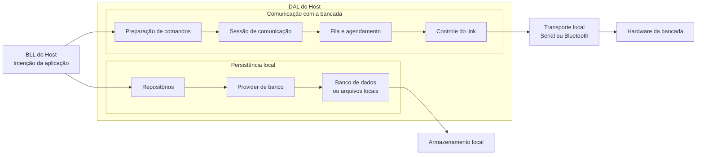

⬅ [Retornar para API e Host Local](04-api-e-host-local.md)
⬅ [Retornar para Índice Geral](../00-INDICE.md)

# DAL do Host

A **DAL do Host** é o bloco da aplicação responsável pelos acessos técnicos usados pelo software local.

Ela fica abaixo da BLL e oferece caminhos controlados para que a aplicação consiga se comunicar com recursos externos ou persistentes. No SimulDIESEL, isso inclui tanto a comunicação com a bancada quanto o acesso a dados locais, como banco de dados e arquivos.

A BLL expressa **o que** a aplicação quer fazer. A DAL organiza **como** essa intenção será encaminhada para o destino técnico correto.

## Posição da DAL dentro do host

A DAL fica abaixo da BLL e concentra os acessos técnicos que a aplicação precisa realizar.

Dentro do host local, ela pode ser entendida por dois caminhos principais:

- **comunicação com a bancada**, quando a aplicação precisa enviar ou receber dados do hardware;
- **persistência local**, quando a aplicação precisa consultar ou salvar informações em banco de dados ou arquivos.

O diagrama mostra que a DAL possui dois papéis técnicos principais. Um caminho organiza a comunicação com a bancada. O outro organiza a persistência local de dados.

## Comunicação com a bancada

O caminho de comunicação com a bancada é usado quando a aplicação precisa enviar comandos ao hardware ou receber respostas e eventos.

Nesse caminho, a DAL organiza a intenção recebida da BLL, prepara a mensagem, mantém a sessão de comunicação, controla a ordem de envio e entrega os dados ao transporte local.

Esse bloco protege a BLL dos detalhes técnicos da comunicação com o hardware.

## Persistência local

O caminho de persistência local é usado quando a aplicação precisa salvar, consultar ou organizar informações em banco de dados ou arquivos locais.

Nesse caminho entram repositórios, providers de banco e estruturas responsáveis por gravar ou recuperar dados usados pelo sistema.

Esse bloco protege a BLL dos detalhes de armazenamento, como caminho físico do arquivo, conexão com banco ou tecnologia usada para persistência.

## Preparação de comandos

A preparação de comandos é a entrada do caminho de comunicação com a bancada.

Ela recebe uma intenção já definida pela BLL e prepara essa intenção para ser enviada ao hardware em uma forma adequada para as camadas inferiores.

## Sessão de comunicação

A sessão de comunicação organiza a conversa entre o host e a bancada.

Ela permite que envio, recebimento, eventos e respostas sejam tratados como parte de uma comunicação contínua.

## Fila e agendamento

A fila e o agendamento controlam a ordem de envio das mensagens para a bancada.

Esse bloco evita que várias partes da aplicação disputem a comunicação ao mesmo tempo sem organização.

## Controle do link

O controle do link cuida da etapa mais próxima do transporte local.

Ele prepara a mensagem para trafegar pela conexão disponível e acompanha a troca de dados entre o host e a bancada.

## Relação com a BLL

A BLL fica acima da DAL.

Ela solicita operações em linguagem de aplicação: consultar, salvar, conectar, acionar uma placa ou executar uma função.

A DAL recebe essa intenção e encaminha para o caminho técnico adequado: comunicação com a bancada ou persistência local.

## Relação com transporte e armazenamento

Abaixo da DAL existem destinos técnicos diferentes.

Quando a operação é de comunicação, a DAL entrega os dados ao transporte local, como Serial ou Bluetooth.

Quando a operação é de persistência, a DAL entrega a solicitação ao provider de banco ou ao mecanismo de armazenamento local.

## Glossário

- **DAL**: camada responsável pelos acessos técnicos da aplicação, incluindo comunicação com hardware e persistência de dados.
- **Banco de dados**: estrutura usada para armazenar informações persistentes da aplicação.
- **Controle do link**: parte da DAL que acompanha a troca de dados próxima ao transporte local.
- **Fila de envio**: estrutura usada para controlar a ordem em que mensagens são transmitidas.
- **Persistência local**: armazenamento de dados em banco ou arquivos locais.
- **Provider de banco**: componente que encapsula a tecnologia usada para acessar o banco de dados.
- **Repositório**: componente que oferece operações organizadas de leitura e gravação de dados.
- **Sessão de comunicação**: organização contínua da conversa entre host e bancada.
- **Transporte local**: camada que envia e recebe dados usando Serial ou Bluetooth.

## Próximas camadas

- [Sessão, SDH e SDGW na DAL](06-dal-do-host/01-sessao-sdh-e-sdgw.md)
- [Framing, Scheduler e Supervisor](06-dal-do-host/02-framing-scheduler-e-supervisor.md)
