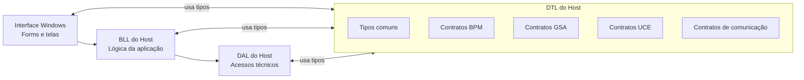

⬅ [Retornar para API e Host Local](04-api-e-host-local.md)
⬅ [Retornar para Índice Geral](../00-INDICE.md)

# DTL do Host

A **DTL do Host** é o bloco da aplicação responsável por definir a forma dos dados que circulam entre as camadas do software local.

Ela não executa operação, não abre conexão, não acessa banco de dados e não conversa diretamente com o hardware. Sua função é fornecer tipos compartilhados para que a interface, a BLL e a DAL consigam trocar informações de forma estável e previsível.

Em termos práticos, a DTL funciona como o vocabulário comum do host local.

## Posição da DTL dentro do host

A DTL não fica em uma única linha vertical da pilha como a BLL ou a DAL. Ela é uma camada compartilhada, usada por vários pontos da aplicação.

O diagrama mostra que a DTL é consultada por várias camadas. Ela não decide o fluxo da aplicação; ela define os formatos usados durante esse fluxo.

## Tipos comuns

Os tipos comuns representam informações simples e reutilizáveis por várias partes do host.

Eles podem descrever estados gerais, resultados de operação, informações de dispositivo ou estruturas compartilhadas que não pertencem exclusivamente a uma placa específica.

## Contratos BPM

Os contratos da BPM representam os dados usados para interagir com o bloco central da bancada.

Eles ajudam a padronizar informações relacionadas a estado da conexão, identificação de dispositivos, comandos gerais e respostas associadas à BPM.

## Contratos GSA

Os contratos da GSA representam os dados usados nas operações do Gerador de Sinais Analógicos.

Eles organizam informações relacionadas a canais, comandos de operação, respostas e eventos ligados à geração de sinais elétricos contínuos.

## Contratos UCE

Os contratos da UCE representam os dados usados nas operações da Unidade de Comunicação Externa.

Eles organizam informações ligadas às interfaces de comunicação da bancada, incluindo configuração, estado, envio, recebimento e eventos relacionados à placa.

## Contratos de comunicação

Os contratos de comunicação definem estruturas usadas quando uma informação precisa atravessar as camadas do host e chegar às partes responsáveis por comunicação técnica.

Esses contratos mantêm a separação entre a intenção da aplicação e os formatos internos usados no transporte ou nos serviços de comunicação.

## Relação com as outras camadas

A DTL é usada por UI, BLL e DAL.

A interface usa tipos da DTL para exibir dados ao operador.  
A BLL usa tipos da DTL para organizar operações e resultados.  
A DAL usa tipos da DTL para receber comandos estruturados e devolver respostas em formatos conhecidos.

Essa separação evita que cada camada invente sua própria forma de representar a mesma informação.

## Glossário

- **DTL**: camada de tipos compartilhados usada para padronizar dados entre as camadas do host.
- **Contrato**: formato combinado para representar uma informação ou operação dentro do software.
- **Tipo comum**: estrutura reutilizável por várias partes da aplicação.
- **Contrato BPM**: tipo de dado relacionado à BPM.
- **Contrato GSA**: tipo de dado relacionado à GSA.
- **Contrato UCE**: tipo de dado relacionado à UCE.
- **Contrato de comunicação**: tipo de dado usado para organizar informações ligadas à comunicação interna do host.

## Próximas camadas

- [Contratos SDH, SDGW e DTOs](07-dtl-do-host/01-contratos-sdh-e-dtos.md)
